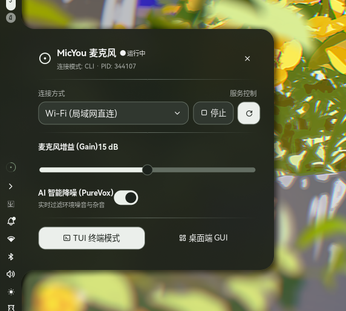

<div align="center">
  
  <h1>noctalia-plugin-micyou</h1>
  
  <b>简体中文</b> | <a href="./README.md">English</a>

  <br>
  <br>

  <a href="https://github.com/LanRhyme/MicYou"></a>
  <a href="https://github.com/LanRhyme/noctalia-plugin-micyou/blob/main/LICENSE"></a>
  <a href="https://qm.qq.com/q/V16hPpWPKO"></a>
  <a href="https://t.me/MicYouChannel"></a>

  <h6>赞助我</h6>

  <a href="https://afdian.com/a/LanRhyme" target="_blank" rel="noopener noreferrer"></a>

  <br>

  适用于 Noctalia 5 Shell 的 MicYou 控制与动态音量环监听插件

  实时音频动态音量环 · 附着式交互控制面板 · 无头后台 CLI 服务 · 控制中心快捷卡片

</div>

## 软件截图

<div align="center">
  
</div>

## 主要功能

- 复刻 Tauri 端 AudioRing 算法，基于 21 阶 GPU 纹理缓存矢量圆弧帧与 Lerp 插值实现丝滑的实时声音动态反馈
- 纯后台无头守护服务，通过读取进程状态与流式解析监听实时音频电平，零多余子进程开销
- 原生附着式交互控制面板
  - 自由切换 Wi-Fi、USB (ADB) 与 Web 连接模式
  - 实时麦克风增益 Gain 滑块调节（0 至 30 dB）
  - AI 智能降噪 PureVox 一键开关
  - TUI 终端模式与桌面端 GUI 快速唤起入口
- 控制中心快捷开关卡片支持
- 全局自动同步当前桌面的莫兰迪动态配色

## 环境依赖

确保系统中已安装 `micyou` 或 `micyou-cli` 命令行工具并已加入系统 `PATH` 路径：

```bash
# Arch Linux (AUR)
paru -S micyou-bin
```

## 安装指南

1. 克隆或软链接本仓库至 Noctalia 插件目录：

```bash
git clone https://github.com/LanRhyme/noctalia-plugin-micyou ~/.config/noctalia/plugins/micyou
```

2. 在 `~/.config/noctalia/settings.toml` 中启用插件：

```toml
[plugins]
enabled = [
  "lanrhyme/micyou"
]
```

3. 在 `~/.config/noctalia/settings.toml` 中将小部件添加到状态栏：

```toml
[bar]
widgets = [
  "lanrhyme/micyou:widget"
]
```

## 连接与使用指南

1. 左键点击状态栏 MicYou 图标展开控制面板，选择连接方式（Wi-Fi / USB / Web）并点击 **启动服务**
2. 在手机端选择对应的连接协议：
   - **Wi-Fi 模式**：手机与电脑连接同一局域网 Wi-Fi，打开 MicYou Android App 点击 **Wi-Fi 模式** 自动发现并连接
   - **USB 模式**：Android 手机开启 USB 调试模式，使用数据线连接电脑，在 App 中点击 **USB 模式** 直连
   - **Web 模式**：在电脑控制面板中启动后，用任意手机浏览器扫码或访问局域网地址即可开始收音，无需安装客户端
3. 对准手机麦克风说话，Noctalia 状态栏上的音量环将根据说话声音电平实时张开并呈现动态回落

## 交互手势

- 鼠标左键：打开或关闭附着式控制面板
- 鼠标右键：快速启动或停止 MicYou 服务
- 鼠标中键：在终端中打开 TUI 控制台

## 主项目

本插件为 [MicYou](https://github.com/LanRhyme/MicYou) 生态组件之一

## 开源协议

MIT License
